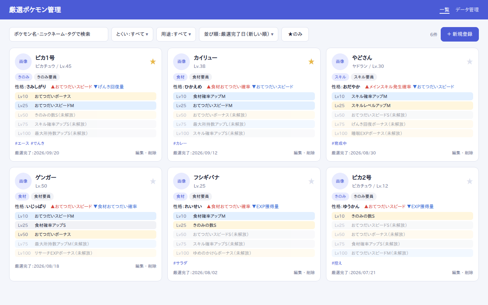

# 厳選ポケモン管理（pokemon-sleep-kensen-tracker）

ポケモンスリープで **厳選が完了したポケモン** を記録・一覧・検索できる Web アプリです。
性格・サブスキル・食材・用途・メモなどをまとめて管理し、育成計画を立てやすくします。

## ステータス

現在は **設計段階** です（実装はまだありません）。設計書は [`design/`](./design/README.md) にあります。

## 主な機能（予定）

- 厳選ポケモンの登録・編集・削除
- ポケモン名・ニックネーム・タグでの検索、とくい・用途・お気に入りでの絞り込み
- サブスキルのレア度色分け、レベルに応じた未解放表示
- JSON でのエクスポート / インポート（バックアップ）
- データはブラウザ内に保存（ログイン不要・サーバー不要）

## 注意

本アプリは非公式のファンツールです。株式会社ポケモン、任天堂、クリーチャーズ、ゲームフリーク、
SELECT BUTTON 各社とは一切関係ありません。
