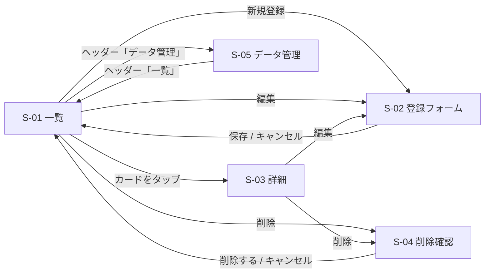
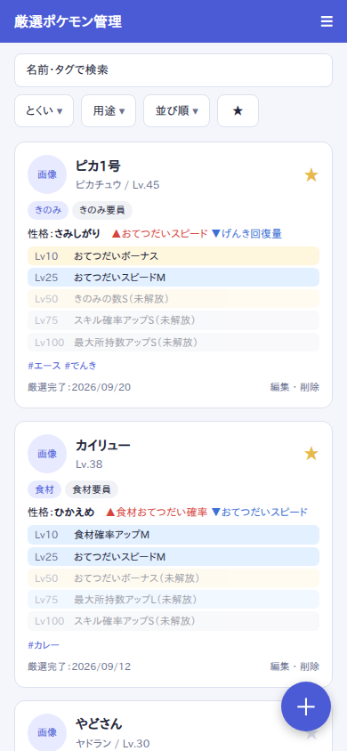
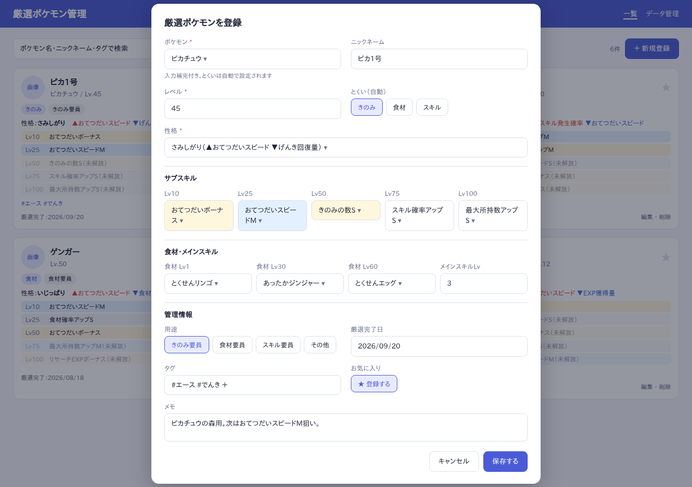
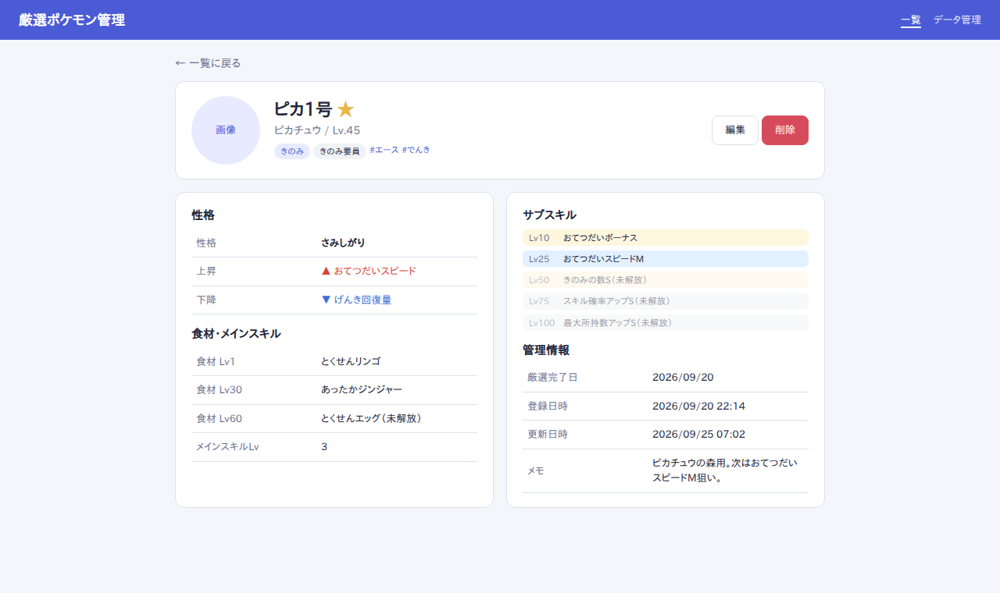
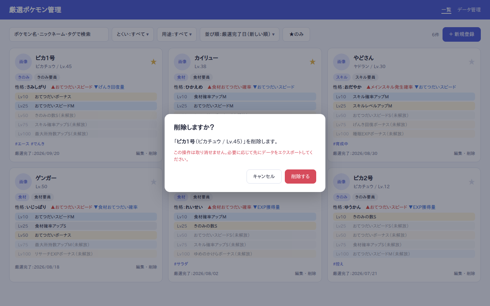
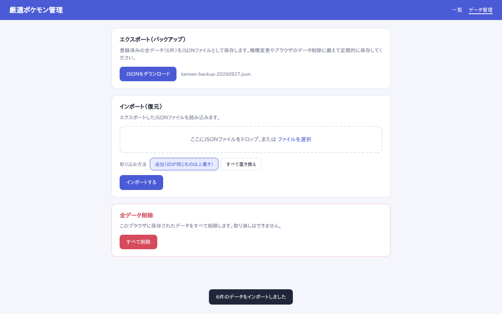

# 02. 画面設計

画面イメージは [`mockups/`](./mockups) の HTML をヘッドレスブラウザで撮影したものです。
表示しているポケモンはすべてサンプルデータです。

## 画面一覧・遷移

| ID | 画面 | URL（ハッシュ） | 種別 |
|----|------|----------------|------|
| S-01 | 一覧 | `#/` | ページ |
| S-02 | 登録・編集フォーム | `#/new` / `#/edit/:id` | モーダル（一覧の上に表示） |
| S-03 | 詳細 | `#/detail/:id` | ページ |
| S-04 | 削除確認 | — | ダイアログ |
| S-05 | データ管理 | `#/data` | ページ |

共通ヘッダーにアプリ名と「一覧」「データ管理」のナビゲーションを置く。スマホではハンバーガーメニューにまとめる。

---

## S-01 一覧

### PC

### スマートフォン

### 表示項目（カード）

| 項目 | 内容 |
|------|------|
| 画像 | ポケモン画像の枠（MVPはプレースホルダー） |
| 名前 | ニックネームがあればニックネームを大きく、その下に「ポケモン名 / Lv」 |
| お気に入り | ★。タップで ON/OFF を切り替え（その場で保存） |
| バッジ | とくい・用途 |
| 性格 | 性格名と ▲上昇 / ▼下降（補正なし性格は「補正なし」） |
| サブスキル | Lv10〜Lv100 の5枠。レア度で背景色を変える（金・青・白）。現在のレベルで未解放の枠は薄く表示し「（未解放）」を付ける |
| タグ | `#タグ` 形式で表示 |
| フッター | 厳選完了日、編集・削除リンク |

### 操作

| 操作 | 動作 |
|------|------|
| 検索ボックス | ポケモン名・ニックネーム・タグを部分一致で検索（入力ごとに即時反映） |
| とくい / 用途 | プルダウンで絞り込み（初期値「すべて」） |
| 並び順 | 厳選完了日（新→旧 / 旧→新）、レベル（高→低）、ポケモン名（五十音）、登録日（新→旧） |
| ★のみ | お気に入りのみ表示するトグル |
| ＋新規登録 | S-02 を新規モードで開く（スマホは右下のフローティングボタン） |
| カード本体 | S-03 詳細へ遷移 |

- 検索条件・並び順は localStorage に保存し、次回も同じ条件で表示する。
- 0件のときは「まだ登録がありません。＋新規登録から追加しましょう」と表示する。
- 条件に一致するものが0件のときは「条件に一致するポケモンがいません」と条件クリアボタンを表示する。
- レイアウト：PC 3列 / タブレット 2列 / スマホ 1列。

---

## S-02 登録・編集フォーム

| 項目 | 入力方式 | 必須 | 備考 |
|------|----------|------|------|
| ポケモン | 入力補完付きセレクト | ○ | マスタから選択。選ぶと「とくい」「食材候補」を自動設定 |
| ニックネーム | テキスト | | 最大20文字 |
| レベル | 数値 | ○ | 1〜100 |
| とくい | 表示のみ（自動） | | ポケモンから決まる |
| 性格 | セレクト | ○ | 「さみしがり（▲おてつだいスピード ▼げんき回復量）」のように補正も表示 |
| サブスキル Lv10〜Lv100 | セレクト×5 | | サブスキルマスタから選択。選択値に応じて背景をレア度色に。同じサブスキルの重複選択は警告 |
| 食材 Lv1 / Lv30 / Lv60 | セレクト×3 | | 選んだポケモンの食材候補のみを表示 |
| メインスキルLv | 数値 | | 1〜ポケモンごとの上限 |
| 用途 | ラジオ | | きのみ要員 / 食材要員 / スキル要員 / その他。初期値は「とくい」に合わせる |
| 厳選完了日 | 日付 | ○ | 初期値は今日 |
| タグ | タグ入力 | | Enter で追加、× で削除。最大10個 |
| お気に入り | トグル | | |
| メモ | テキストエリア | | 最大500文字 |

- 新規モードの見出しは「厳選ポケモンを登録」、編集モードは「〇〇を編集」。
- 必須未入力のまま保存するとフィールド下に赤字でエラーを表示し、保存しない。
- 入力途中でキャンセルした場合は「編集内容を破棄しますか？」を確認する。
- 保存後は一覧に戻り、トースト「保存しました」を表示する。
- スマホでは全画面表示のシートとして表示する。

---

## S-03 詳細

- 上部：画像・名前・お気に入り・バッジ・タグ、右側に「編集」「削除」ボタン。
- 左カラム：性格（上昇・下降）、食材 Lv1/30/60、メインスキルLv。
- 右カラム：サブスキル5枠（未解放表示は一覧と同じ）、厳選完了日・登録日時・更新日時・メモ。
- スマホでは1カラムに縦並び。
- 存在しないIDを開いた場合は「データが見つかりません」と一覧へ戻るリンクを表示する。

---

## S-04 削除確認

- 対象の名前（ニックネーム・ポケモン名・Lv）を明示する。
- 取り消せない旨と、エクスポートを促す注意書きを表示する。
- 「削除する」で削除し、一覧に戻ってトースト「削除しました」を表示する。

---

## S-05 データ管理

| 区分 | 内容 |
|------|------|
| エクスポート | 全件を JSON でダウンロード。ファイル名は `kensen-backup-YYYYMMDD.json` |
| インポート | JSON ファイルを選択 or ドロップ。取り込み方法を選択して実行 |
| └ 追加 | 既存データを残し、同じ ID のものは上書き、新しい ID は追加 |
| └ すべて置き換え | 既存データを全削除してから取り込む（実行前に確認ダイアログ） |
| 全データ削除 | 確認ダイアログ（「削除」と入力させる）を経て全件削除 |

- インポートするファイルは [03_data_model.md](./03_data_model.md) のスキーマで検証し、不正な場合は取り込まずにエラー内容（何件目のどの項目が不正か）を表示する。
- 完了時はトーストで件数を表示する（例：「6件のデータをインポートしました」）。
