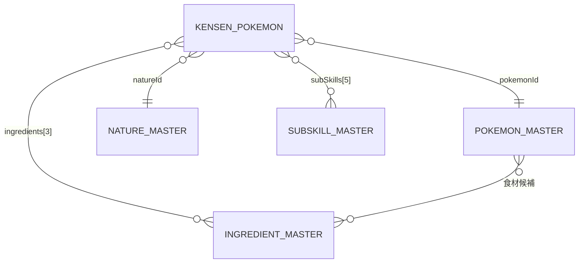

# 03. データ設計

## 全体像



- **KENSEN_POKEMON**（厳選ポケモン）… ユーザーが登録するデータ。localStorage に保存する。
- **〜_MASTER** … ゲームの固定データ。アプリのソースコード内に JSON として持つ（ユーザーは編集しない）。

## 厳選ポケモン（KensenPokemon）

| 項目 | キー | 型 | 必須 | 説明 |
|------|------|----|------|------|
| ID | `id` | string (UUID) | ○ | 登録時に `crypto.randomUUID()` で採番 |
| ポケモン | `pokemonId` | string | ○ | ポケモンマスタのID |
| ニックネーム | `nickname` | string | | 0〜20文字 |
| レベル | `level` | number | ○ | 1〜100 |
| 性格 | `natureId` | string | ○ | 性格マスタのID |
| サブスキル | `subSkills` | (string \| null)[5] | ○ | 添字0〜4 が Lv10/25/50/75/100 に対応。未入力は `null` |
| 食材 | `ingredients` | (string \| null)[3] | ○ | 添字0〜2 が Lv1/30/60 に対応。未入力は `null` |
| メインスキルLv | `mainSkillLevel` | number \| null | | 1〜 |
| 用途 | `role` | `"berry"` \| `"ingredient"` \| `"skill"` \| `"other"` | ○ | |
| 厳選完了日 | `completedAt` | string (`YYYY-MM-DD`) | ○ | |
| タグ | `tags` | string[] | ○ | 最大10個、各20文字まで。空配列可 |
| お気に入り | `favorite` | boolean | ○ | |
| メモ | `memo` | string | | 0〜500文字 |
| 登録日時 | `createdAt` | string (ISO 8601) | ○ | |
| 更新日時 | `updatedAt` | string (ISO 8601) | ○ | |

※「とくい」はポケモンマスタから導出するため保存しない。

### 例

```json
{
  "id": "5f0c1d7e-3b1a-4c55-9a53-0a7f3f1c2b11",
  "pokemonId": "pikachu",
  "nickname": "ピカ1号",
  "level": 45,
  "natureId": "lonely",
  "subSkills": ["helping_bonus", "helping_speed_m", "berry_finding_s", "skill_trigger_s", "inventory_up_s"],
  "ingredients": ["fancy_apple", "warming_ginger", "fancy_egg"],
  "mainSkillLevel": 3,
  "role": "berry",
  "completedAt": "2026-09-20",
  "tags": ["エース", "でんき"],
  "favorite": true,
  "memo": "ピカチュウの森用。次はおてつだいスピードM狙い。",
  "createdAt": "2026-09-20T13:14:00.000Z",
  "updatedAt": "2026-09-24T22:02:00.000Z"
}
```

## マスタデータ

### 性格マスタ（NatureMaster）

`{ id, name, up, down }`。`up` / `down` は下記の能力キー、補正なしは `null`。

| 能力キー | 表示名 |
|----------|--------|
| `speed` | おてつだいスピード |
| `energy` | げんき回復量 |
| `ingredient` | 食材おてつだい確率 |
| `skill` | メインスキル発生確率 |
| `exp` | EXP獲得量 |

| ▲上昇 ＼ ▼下降 | speed | energy | ingredient | skill | exp |
|---|---|---|---|---|---|
| **speed** | がんばりや | さみしがり | いじっぱり | やんちゃ | ゆうかん |
| **energy** | ずぶとい | すなお | わんぱく | のうてんき | のんき |
| **ingredient** | ひかえめ | おっとり | てれや | うっかりや | れいせい |
| **skill** | おだやか | おとなしい | しんちょう | きまぐれ | なまいき |
| **exp** | おくびょう | せっかち | ようき | むじゃき | まじめ |

対角線（がんばりや・すなお・てれや・きまぐれ・まじめ）は補正なし。

### サブスキルマスタ（SubSkillMaster）

`{ id, name, rarity }`。`rarity` は `gold` / `blue` / `white` で、画面の背景色に使う。

| rarity | サブスキル |
|--------|-----------|
| gold | きのみの数S、おてつだいボーナス、睡眠EXPボーナス、げんき回復ボーナス、リサーチEXPボーナス、ゆめのかけらボーナス、スキルレベルアップM |
| blue | おてつだいスピードM、食材確率アップM、スキル確率アップM、スキルレベルアップS、最大所持数アップM、最大所持数アップL |
| white | おてつだいスピードS、食材確率アップS、スキル確率アップS、最大所持数アップS |

### ポケモンマスタ（PokemonMaster）

`{ id, name, specialty, ingredientCandidates: string[][3], maxMainSkillLevel }`

- `specialty`: `"berry"` \| `"ingredient"` \| `"skill"`
- `ingredientCandidates[i]`: Lv1 / Lv30 / Lv60 それぞれで選べる食材IDの候補

### 食材マスタ（IngredientMaster）

`{ id, name }`（例：`fancy_apple` / とくせんリンゴ）

> マスタの内容はゲームのアップデートで追加・変更される。
> `src/data/*.json` にまとめ、更新時はJSONだけを差し替えればよい構成にする。
> 初期データの作成・検証は実装フェーズで行う。

## 保存形式（localStorage）

| キー | 内容 |
|------|------|
| `kensen-tracker:v1:pokemons` | `KensenPokemon[]` の JSON 文字列 |
| `kensen-tracker:v1:view` | 一覧の検索条件・並び順 `{ query, specialty, role, favoriteOnly, sort }` |

- キーにバージョン（`v1`）を含め、将来データ形式を変える場合はマイグレーション処理で `v2` に移し替える。
- localStorage が使えない（プライベートモード等）場合は画面上部に警告バナーを表示し、メモリ上でのみ動作させる。

## エクスポートファイル形式

```json
{
  "app": "pokemon-sleep-kensen-tracker",
  "schemaVersion": 1,
  "exportedAt": "2026-09-27T10:00:00.000Z",
  "pokemons": [ /* KensenPokemon[] */ ]
}
```

インポート時は `app` と `schemaVersion` を確認し、`pokemons` の各要素を上記の型・必須・範囲で検証する。
マスタに存在しない ID（新ポケモン等）は警告を出したうえで取り込み、表示は ID のままとする。
