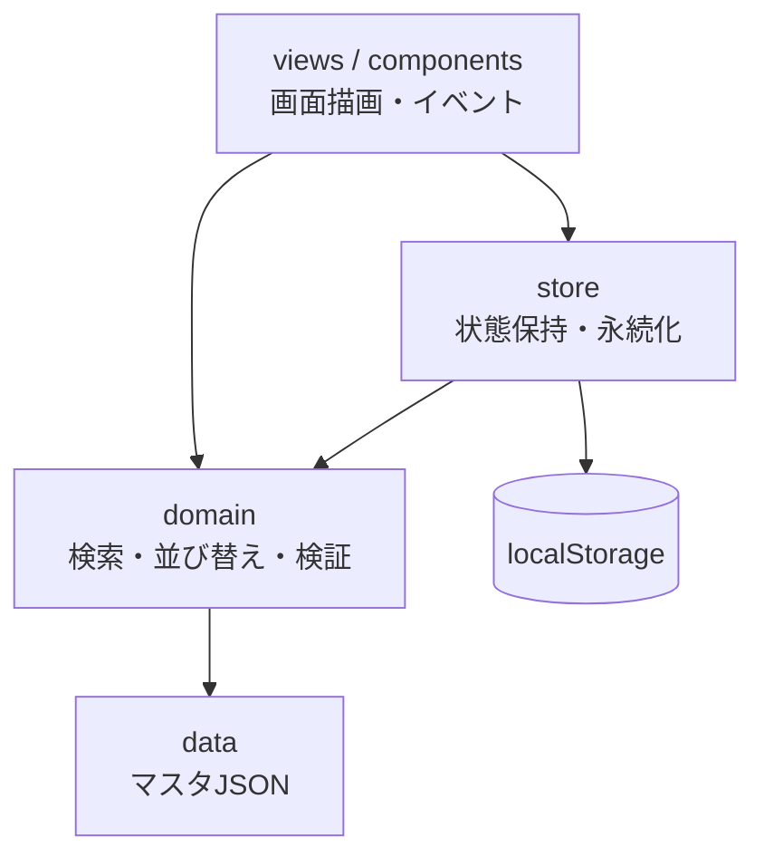

# 04. アーキテクチャ・技術構成

## 方針

- **サーバーを持たない静的サイト**。データはすべてブラウザ内（localStorage）に保存する。
- ビルドした成果物を **GitHub Pages** で公開する。
- 規模が小さいため、依存ライブラリは最小限にする。

## 技術スタック

| 分類 | 採用 | 理由 |
|------|------|------|
| 言語 | TypeScript | データ構造（性格・サブスキル等）の取り違えを型で防ぐ |
| ビルド | Vite | 設定が少なく、GitHub Pages 向けの静的ビルドが容易 |
| UI | 素の DOM 操作 + 小さな描画関数 | 画面数が少なく、フレームワーク導入のメリットが小さい |
| スタイル | 素の CSS（CSS変数でテーマ定義） | モックアップの `mock.css` をそのまま発展させられる |
| ルーティング | ハッシュルーティング（`#/detail/:id` 等） | GitHub Pages でサーバー設定なしに動く |
| テスト | Vitest | 検索・絞り込み・インポート検証などのロジックを単体テスト |
| CI/CD | GitHub Actions | push 時に lint・テスト、main へのマージで Pages にデプロイ |

> 画面や状態が増えてきた場合は Preact / React への移行を検討する。
> ロジック層（store / domain）を UI から分離しておき、移行時の影響を画面部分に閉じ込める。

## ディレクトリ構成（予定）

```
pokemon-sleep-kensen-tracker/
├── design/                 # 設計書（本ドキュメント）
├── public/
├── src/
│   ├── main.ts             # エントリ・ルーター
│   ├── data/               # マスタデータ（JSON）
│   │   ├── pokemons.json
│   │   ├── natures.json
│   │   ├── subskills.json
│   │   └── ingredients.json
│   ├── domain/             # 型定義・検索/並び替え・バリデーション（UI非依存）
│   ├── store/              # localStorage の読み書き・マイグレーション・エクスポート/インポート
│   ├── views/              # 画面（list / form / detail / data）
│   ├── components/         # カード・ダイアログ・トースト・タグ入力など
│   └── styles/
├── tests/
├── index.html
└── vite.config.ts
```

## レイヤー構成



- `views` は `store` の状態を購読し、変更があれば再描画する。
- `domain` は純粋関数のみで構成し、単体テストの主対象とする。

## 公開・運用

- GitHub Actions で `main` へのマージ時に `vite build` → GitHub Pages へデプロイ。
- 画面フッターと README に「非公式のファンツールであり、株式会社ポケモン等とは関係ない」旨を記載する。
- ポケモン画像は同梱しない（MVP はプレースホルダー）。

## 実装の進め方（案）

1. プロジェクト雛形（Vite + TypeScript + Vitest + Actions）
2. マスタデータ JSON の作成
3. domain / store の実装とテスト
4. 一覧・登録フォーム（S-01, S-02）
5. 詳細・削除（S-03, S-04）
6. データ管理（S-05）
7. レスポンシブ調整・GitHub Pages 公開
